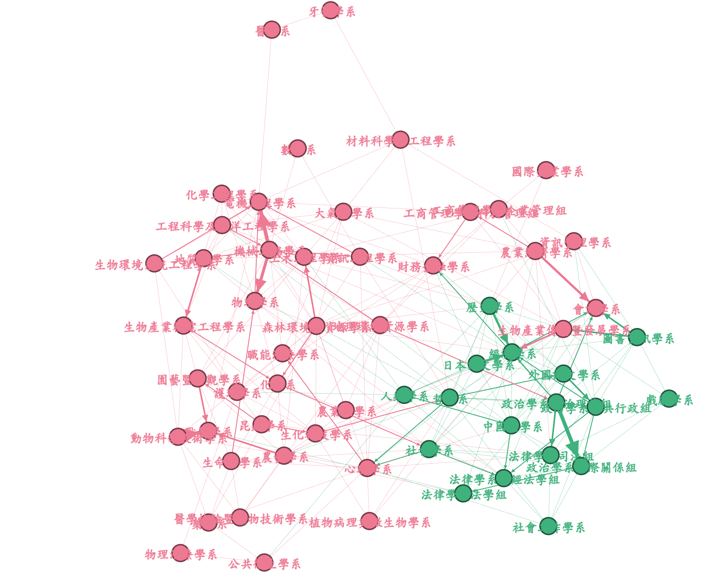

```{r setup, include=FALSE}
knitr::opts_chunk$set(
	echo = FALSE,
	message = FALSE,
	warning = FALSE)
source('plot_func.R')
library(knitr)
```


```{r}
library(dplyr)
whole <- readr::read_csv('data/network_attributes.csv') %>% 
  filter(Id != '牙醫學系') %>%
  mutate(jobStability = 100/`industr_2nd-3rd`)
Arts <- readr::read_csv('data/transfer_Arts_attributes.csv') %>% 
  filter(Id != '牙醫學系') %>%
  mutate(jobStability = 100/`industr_2nd-3rd`)
nonArts <- readr::read_csv('data/transfer_nonArts_attributes.csv')  %>% 
  filter(Id != '牙醫學系') %>%
  mutate(jobStability = 100/`industr_2nd-3rd`)
```

我們依據學院將各科系分成：

- 人文領域：文學院、社會科學院、法律學院
- 非人文領域：剩下的 8 個學院

首先，我們必須先確定**將科系分成「人文領域」與「非人文領域」是合理的**。透過 Gephi Layout 的演算法，我們可以將「轉系網絡」繪製成下圖。可以發現這張圖裡，人文領域的科系確實形成一個彼此相當靠近的群集。

```{r fig.cap='轉系網絡，綠色為人文領域科系、粉色為非人文領域。這邊使用 Gephi 的 FortAlas2 layout。由這張圖可知，將網絡區分成「人文」、「分人文」兩塊似乎是合理的，因為人文領域的科系在網絡上的位置是接近的。'}

```

## 建立子網絡

我們透過 Gephi 篩選出屬於「文學院」、「社科院」以及「法律學院」的科系，形成一個**人文領域子網絡**。剩下的科系則另外形成一個**非人文領域子網絡**。換言之，**不考慮兩個子網絡之間的連結**。

## 人文領域 vs. 非人文領域

篩選出兩個子網絡之後，我們分別使用兩個子網絡**重新計算各個科系的 PageRank**。換言之，我們想探討的是網絡**內部**的情況：**人文領域內的轉系**是否與就業穩定程度有關？


```{r}
corr_arts <- cor(Arts$jobStability, Arts$pageranks)
```

(ref:arts-transferSubnet-pagerank) **人文領域**子網絡下，各科系 PageRank 與就業穩定程度之關聯。相關係數：`r round(corr_arts, 3)`。

```{r arts-transferSubnet-pagerank, fig.cap='(ref:arts-transferSubnet-pagerank)'}
plot_xy(Arts, x = Arts$jobStability, 
        y = Arts$pageranks,
        title = '人文領域科系 PageRank vs. 就業穩定程度',
        xlab = '就業穩定程度',
        ylab = '科系 PageRank (人文子網絡)') %>% print()
```


```{r}
corr <- cor(nonArts$jobStability, nonArts$pageranks)
```

(ref:nonArts-transferSubnet-pagerank) **非人文領域**子網絡下，各科系 PageRank 與就業穩定程度之關聯。相關係數：`r round(corr, 3)`。

```{r nonArts-transferSubnet-pagerank, fig.cap='(ref:nonArts-transferSubnet-pagerank)'}
plot_xy(nonArts, x = nonArts$jobStability, 
        y = nonArts$pageranks,
        title = '非人文領域科系 PageRank vs. 就業穩定程度',
        xlab = '就業穩定程度',
        ylab = '科系 PageRank (非人文子網絡)') %>% print()
```

## 小結

將轉系網絡分割成人文與非人文領域後，可以看到一個有趣的現象：人文領域內的轉系網絡下所計算出來的各系 PageRank 與就業穩定程度有**相當高的相關** — **`r round(corr_arts, 4)`**。


