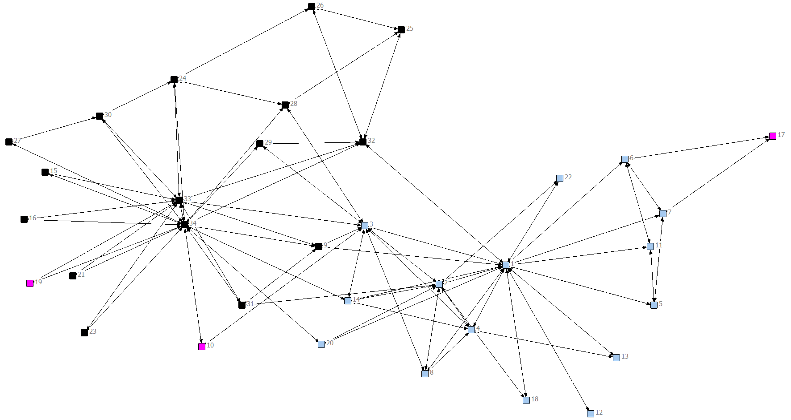
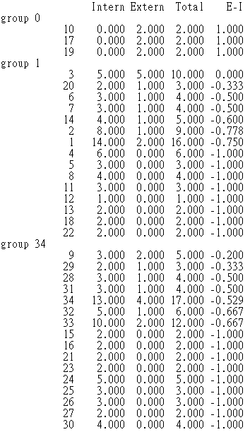
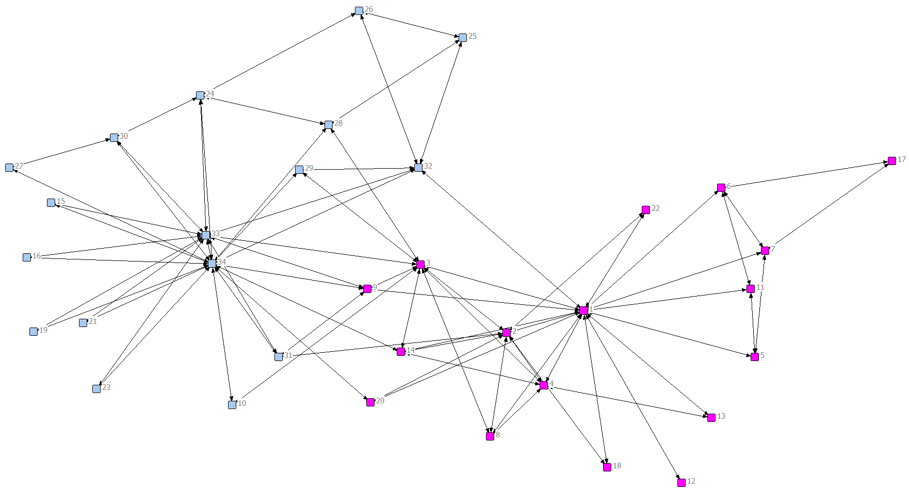
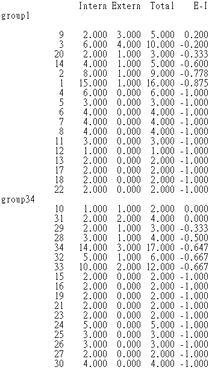

# 第一題

Support Attribute
-----------------

### network-level

| 項目             | 數值   | 說明                        |
|---|---|---|
| E-I Index        | -0.615 | 內向性 $>$ 外向性             |
| Expected value   | 0.187  |                               |
| Permutation Test <br> p $\leqslant$ Ob | 0.000  | p $<$ 0.025時，E-I index值顯著 |

　　在計算網絡整體的凝聚力(cohesion)時，因為E-I
index為負數，因此得知此網絡較偏內向性。經由排列檢定(Permutation
test)檢驗E-I
index顯著與否時，由於在信心水準95%的雙尾檢定下，若p值小於0.025則表示E-I
index值顯著，本題的E-I index(-0.615) 小於期望值(0.187)，需檢視
p $\leqslant$ Ob(0.000)之欄位，故可判斷此網絡整體的內向性是顯著的。

### group-level

|                | E-I Index | 說明            |
|---|---|---|
| **group 0**  | 1.000     | 完全外向        |
| **group 1**  | -0.676    | 內向性 $>$ 外向性 |
| **group 34** | -0.684    | 內向性 $>$ 外向性 |



如上圖所示，該網絡在此屬性下可分為三種小團體：

　　group 0所得E-I index(1)
為完全外向，表示組內的成員彼此完全不會聯繫，皆與另外兩組成員交流。group
1之E-I index(-0.676) 與group 34之E-I index(-0.684)
內向性高，表示組內成員與組內成員之連結大於與組外成員的連結。從視覺化的圖可看出group
1與group 34分別是支持網絡內成員編號1與34的小團體，goup
0之成員則可視為未表態、零散的網絡內個體。

### individual-level

```{r out.width='55%'}

```


**group 0**

five most out-ward: 10, 17,
19。僅有的三位成員皆為外向，完全不會與組內另外二人聯繫。

**group 1**

five most out-ward: 3, 20, 6, 7, 14。除了3
(0)與組內外聯繫平均之外，其他四者皆為負值。

five most in-ward: 4, 5, 8, 11, 12, 13, 18, 22。這些人之E-I
index值皆為-1。

**group 34**

five most out-ward: 9, 29, 28, 31, 34。

five most in-ward: 15, 16, 21, 23, 24, 25, 26, 27, 30。這些人之E-I
index值皆為-1。

Club Attribute
--------------

### network-level 


| 項目             | 數值   | 說明                        |
|---|---|---|
| E-I Index        | -0.718 | 內向性 $>$ 外向性             |
| Expected value   | 0.030  |                               |
| Permutation Test p <br> $\leqslant$ Ob | 0.000  | p $<$ 0.025時，E-I index值顯著 |

使用Club的屬性檢驗時，E-I
index為負數（偏內向性），並且 p $\leqslant$ Ob 欄位之值(0.000)小於0.025，故網絡整體的內向性同樣是顯著的。

### group-level

|                | E-I Index | 說明            |
|---|---|---|
| **group 1**  | -0.728    | 內向性 $>$ 外向性 |
| **group 34** | -0.707    | 內向性 $>$ 外向性 |



　　如上圖所示，該網絡在此屬性下可分為兩種小團體，且兩組內部聯繫皆遠熱絡於外部聯繫，故E-I
index皆為負數。

### individual-level


```{r out.width='55%'}

```


**group 1**

five most out-ward: 9, 3, 20, 14, 2。

five most in-ward: 4, 5, 6, 7, 8, 11, 12, 13, 17, 18, 22。這些人之E-I
index值皆為-1。

**group 34**

five most out-ward: 10, 31, 29, 28, 34。

five most in-ward: 15, 16, 19, 21, 23, 24, 25, 26, 27, 30。這些人之E-I
index值皆為-1。
