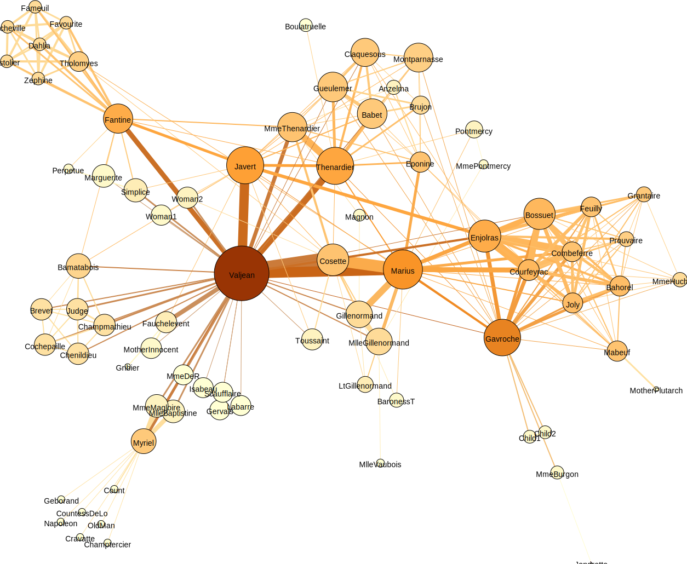
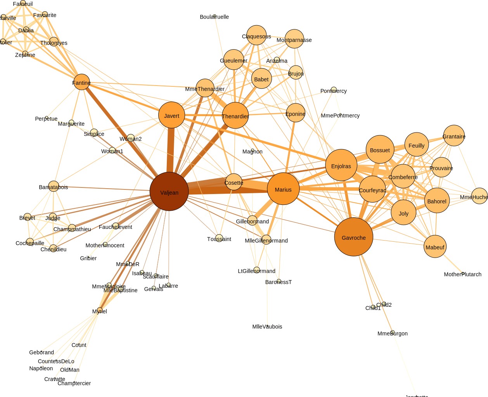
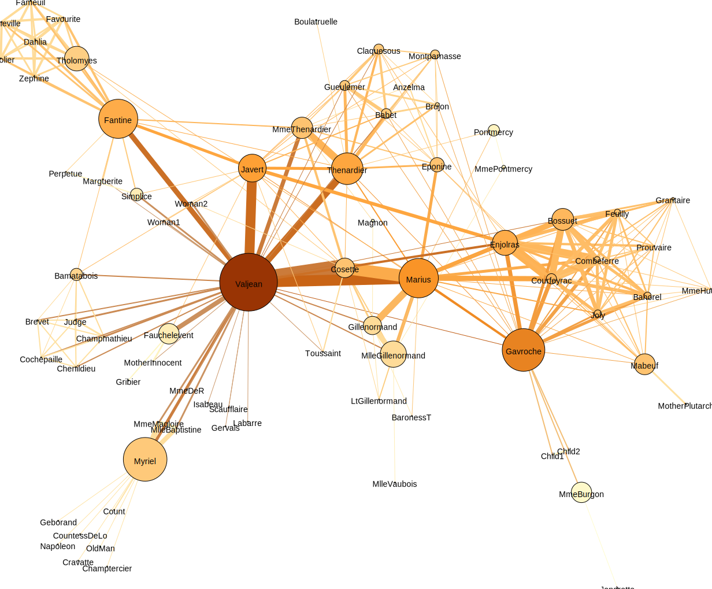
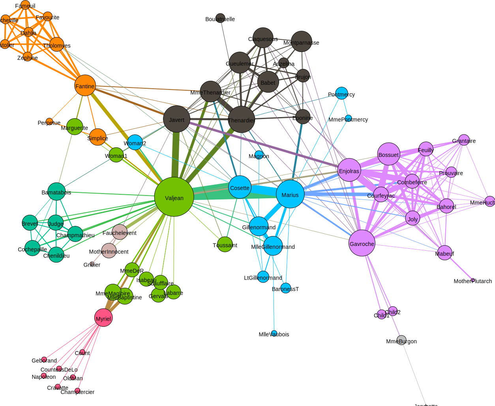
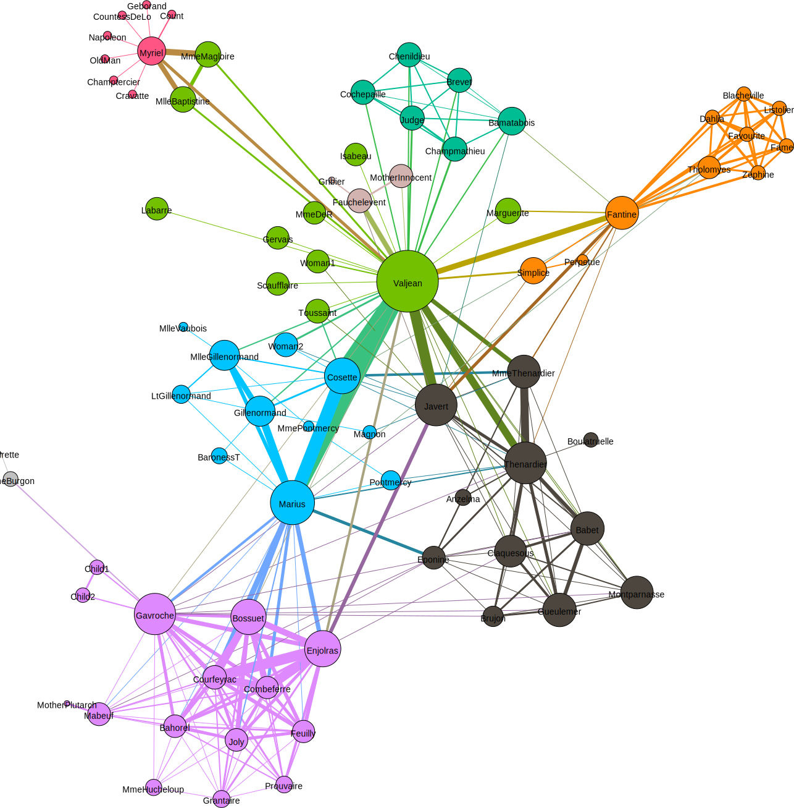
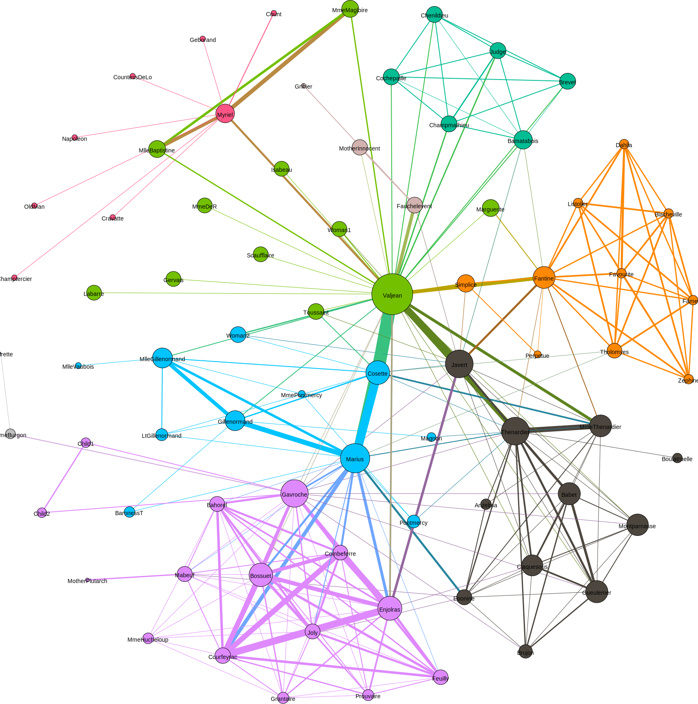
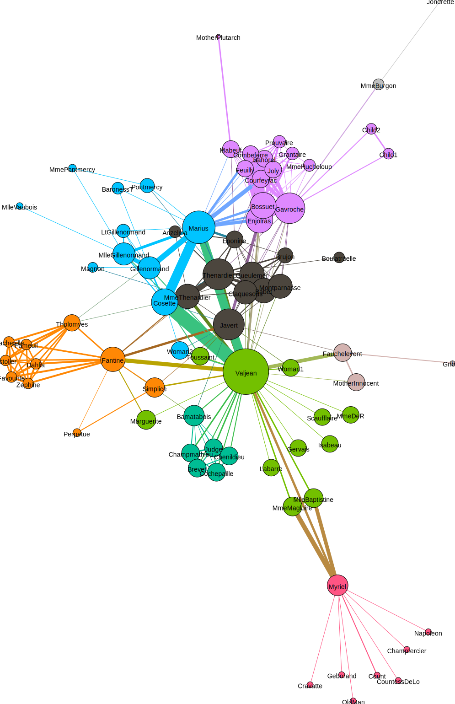

# 第二題

## 2.a

- 透過視覺化的方式來呈現 Les Miserables 來呈現角色的網絡關係圖，每一個節點的顏色代表該節點 degree 值的大小，也就是該節點和多少個其他節點連接。每一個節點的大小代表該節點 closeness centrality 值的大小，也就是該節點到其他節點所需要的最短距離總和的倒數，closeness 值越大代表該節點和其他節點越靠近，處於網路中越中心的地方。 
- 從圖一中可以發現 Valjean 是最重要的節點，根據節點的大小和深淺也可以判斷 Javert, Thenardier, Marius, Gavroche 也是重要的幾個節點。 
- 從圖一中也可以發現由 Fantine 和 Myriel 所延伸出去的節點最不重要，這些節點不僅較小，顏色也較淺，代表和較少的節點連接，並且處於網路的邊陲。

## 2.b

- 瞭解節點的重要性或者性質，除了在 2.a 所使用的 degree 之外，也有其他的指標可以參考。 
    - eigenvector centrality：這個指標用以測量一個節點的影響力，若該節點所連接到的其他節點的 eigenvector centrality 高，則該節點會有相對較高的 eigenvector centrality 值。這個指標不僅考慮到節點的 degree 數量，亦考慮了和哪些節點之間產生連結，也就是把「和特定節點連結的其他節點的中心性」所考慮進來的一種指標。 
    從圖二來看，顏色依然代表該節點 degree 值的大小，而節點大小則代表該節點 eigenvector centrality 的大小，和圖一相比，圖二由 Marius 和 Gavroche 延伸出去的 cluster 的節點大小變得稍大，而其他肉眼可辨的 clusters 的節點大小則變得較小，尤其是在網路左側的 clusters 節點縮小幅度更大。改為使用 eigenvector centrality 後產生的變化凸顯出那些變大或是沒有什麼變化的節點所連接到的其他節點同樣都是中心性較強的節點（剛好是 2.a 所提到的 Valjean, Javert, Thenardier, Marius, Gavroche 五個重要節點），而其他明顯變小的節點則只有一個或是沒有中心性較強的節點和它們連接。
    
    
    - betweenness centrality：這個指標用於衡量一個節點是否位於任兩個其他節點之間的最短距離之上，若該節點的 betweenness centrality 高，代表該節點屬於一種橋樑性的角色，出現在很多節點間的最短距離之中。 
    從圖三來看，顏色依然代表該節點 degree 值的大小，而節點大小則代表該節點 betweenness centrality 的大小，和圖一圖二相比，最明顯的差異在於網路左側的 Fantine 和 Myriel 的節點大小被放大很多，在前兩張圖當中，因為這兩個點並不處於中心性的位置（closeness centrality 低），其向外所連接的 cluster 的重要性也不強（eigenvector centrality 低），導致這兩個節點的重要性無法被凸顯出來。實際在網絡中，這兩個節點獨自連接出了數個較為邊陲的節點，使得這些邊陲的節點們必須高度仰賴於這兩個節點才能夠散播或接收到資訊，在這個角度之下，由於 Fantine 和 Myriel 掌控了邊陲節點向外連接的最短距離，因此有較高的 betweenness centrality。
    
    
    
- 除了節點的特徵之外，網路之中不同 clusters 的分群也是我們關心的特徵，透過分群可以很輕易地判斷出哪些節點之間的同質性較高，分群也可以幫助對於不同類型的 centrality 的大小進行推論。例如，若一個節點獨立連接到一個邊陲的群，則可以推論該節點可能有較高的 betweenness centrality，或是若一個節點所連接到的群有較靠近中心的位置且該群之間的 density 很高，則可以推論該節點可能有較高的 eigenvector centrality。分群的結果如圖四所示，顏色代表不同的群體，而節點大小代表 betweenness centrality 的大小。

## 2.c
本題嘗試利用不同的 layouts 來凸顯網路的特徵，欲呈現的特徵包含節點的 betweenness centrality，透過節點的大小來呈現，節點的分群，透過節點的顏色來呈現，以及節點之間連結的程度，透過連結的粗細來呈現。 
- Force Atlas：呈現如圖五所示，不同的 clusters 在位置上被區隔出來，節點的大小也便於區辨其重要性，不同 clusters 的稠密程度也可以從不同顏色的連結的粗細觀察。

- Fruchterman Reingold：呈現如圖六所示，網路被編排為圓形，不同 clusters 的區別和其各自的稠密程度依然相當明顯，但是不同的節點的重要性變得不明顯。例如次重要的節點像是 Thenardier, Marius, Gavroche 都不在最重要的的節點 Valjean 旁邊，即使他們之間有連結，在視覺上看起來卻有兩步三步之遙。

- YiFan Hu：呈現如圖七所示，該圖和以 Force Atlas 的 layout 製成的圖五很類似，只是把靠近中心的節點排列得更加緊密，把處於邊陲的節點拉得更加遙遠。這種呈現方式可以幫助更明確地找出處於邊陲的節點，但對於處於中心的那群節點來說，由於排列過於緊密，在 clusters 的區別上就沒有前兩張圖來得明顯。

圖七

以上三種 layouts 在視覺呈現上都有各自的優劣之處，但整體來說都適合在本資料中想要凸顯的數個特徵。
