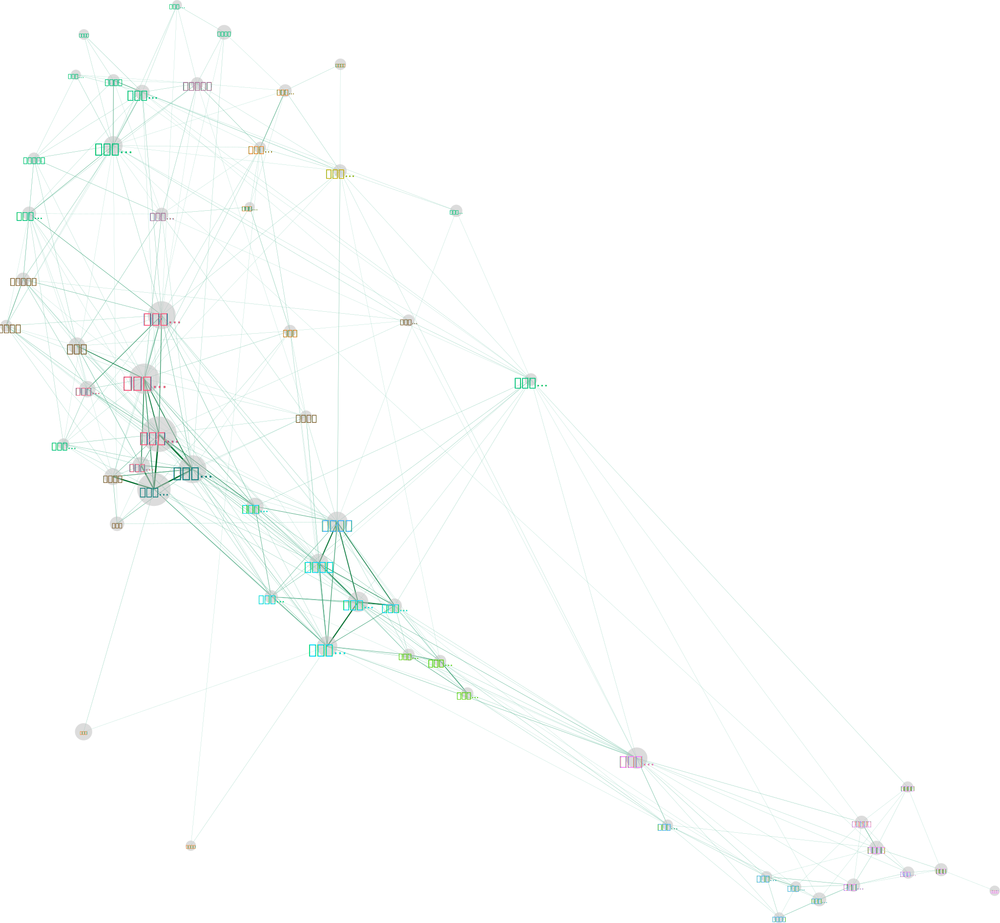

# 第三題：Real World Data

## 構想

大學的科系百百種，在這麼多科系之中，我們能如何了解這些科系的特質？例如，哪些科系是「相似的」？熱門科系有哪些？冷門科系又有哪些？此外，有所謂「特殊的」、難以用前面幾種用語簡單描述的科系嗎？

大學學測申請入學或許提供一種方式，讓我們可以了解大學各科系的特質。這些科系能夠透過申請者形成一個網絡 -- 若同一個申請者同時申請了兩個科系，那這兩個科系就形成連結。透過許多科系形成的網絡，我們或許能夠嘗試回答上述的問題。

### 目標資料

新鮮人查榜的[學測交叉查榜](https://freshman.tw/cross)提供了每年大學申請入學的資料。在每個科系的頁面右欄有現成的網絡資料 -- 例如，在臺大法律系的 [交叉科系分析](https://freshman.tw/cross/104/006342)，可以直接看到同時申請臺大法律系和其它科系的人數。


### 定義網絡

考慮資料取得的容易程度以及伺服器的負擔，我們決定使用** 104 年學測申請入學臺灣大學各系的資料**作為網絡的範圍定義。在此範圍內，網絡的定義如下：

- Nodes
    - 定義：臺大某科系。
          
          例如，臺大圖資為一個 node，臺大森林系為另一個 node。

- Edges
    - 定義：若學生 A 同時申請「科系甲」和「科系乙」，則臺大的甲乙系之間形成連結
    - 特性：
        - Weighted：同時申請「科系甲」和「科系乙」的學生**人數**
        - Undirected (無向連結)


## 資料收集

### 網絡資料爬取

我們使用 Scrapy^[https://scrapy.org] 將臺灣大學各個科系 (共 60 個) 的資料 從[新鮮人查榜](https://freshman.tw/cross/104/001)爬取下來。爬取的資料包含：

1. 科系名稱
1. 系所資訊
1. 交叉科系分析
1. 區域分析 (依准考證號)

此外，臺大各學系所屬學院則由[臺大課程網](https://nol2.aca.ntu.edu.tw/nol/guest/index.php)以及[臺大課號編碼作業說明](https://nol2.aca.ntu.edu.tw/nol/guest/課程編碼說明.pdf)所提供之資訊取得。

Scrapy 爬蟲的原始碼託管於 [GitHub](https://github.com/liao961120/collegeSNA)；詳細的變項描述以及資料清理過程記錄於 [Jupyter Notebook](https://liao961120.github.io/collegeSNA/ntuNetwork)。

### 網絡資料描述

清理過後的資料包含 60 個學系 (node) 以及 634 條連結 (edge)。由於「護理學系(公費生)」並未與網絡中的其它科系形成連結，在視覺化時將其剔除。因此，下文視覺化的網絡由 59 個 node 和 634 條 edge 組成。

整理成網絡資料格式的資料存放於 [`ntuNetwork_edges.csv`](https://bit.ly/2OygdeK) 與 [`ntuNetwork_attr2.csv`](https://bit.ly/2U236by)。


## 預期與假設 {#hypothesis}

我們希望透過這筆資料能得出兩種資訊：(1) 哪些科系是相似的；以及 (2) 在考慮招生人數以及 degree 這兩種資訊下，哪些科系看起來比較特殊。

(1) 的基本假設是「人們在選擇要申請哪些科系時，應該會有某種『偏好[^bias]』使其選擇『相似』的科系」。因此，透過各科系之間的連結數量以及強度，我們或許可自然地將科系進行分群。

(2) 則假設在不考慮各科系的特性下，**若一科系的招生名額越多，其 degree 也應該越大**，因為一科系招生名額越多，通常也有越多人申請，而這些申請者越有機會同時申請其它的科系。我們可以去觀查**哪些科系違反這項直覺**，再去猜想原因為何。

[^bias]: 「偏好」可能是個人興趣，也有可能是家人或社會期待，造成人們在選系時，會選擇一群「相似的」科系。


## 視覺化網絡

依據上述的假設，我們將以下 node 與 edge 的屬性資料對映 (map) 到網絡圖 (圖 \@ref(fig:network)) 中的視覺元素：

- Edge Attributes
    - Thickness & Color gradient: Edge weight (共同申請兩系人數)
        - Minimum: 共同申請人數需大於或等於 3 才形成連結 (資料來源限制)
- Node Attributes
    - Node Size: 招生名額
    - Text size: Degree
    - Text Color: 學院

所有的屬性 (除了 Text Color 之外) 皆有數值梯度，並線性對應到視覺屬性的強度上。

(ref:caption) **104 年學測申請入學 臺大各系申請網絡連結**。svg 原圖： http://bit.ly/104ntuNetwork

```{r network, fig.cap='(ref:caption)'}

```


### Node Size vs. Text Size

根據上述[預期與假設](#hypothesis)的 (2)，我們找出了幾個違反直覺的科系：

- Node 相對 Text 大上許多
    - 意義：申請該系的人不太會申請臺大其它科系
    - 例子：醫學系、人類系、牙醫系 (依偏離程度由大至小排序^[這邊是以視覺直接比較，可能會有誤差。])
    
- Node 相對 Text 小許多：申請該系的人也喜歡申請其它科系
    - 意義：申請該系的人也會申請臺大其它科系
    - 例子：生傳系

由 Node 相對 Text 大上許多的科系，我們或許能做出一些猜想。由於醫學系和牙醫系的申請分數通常很高，其相對較低的 degree 可以反映是**申請者的選擇而非其它因素 (如分數不足) 使其不申請其它科系**。至於人類系的情況則較難詮釋。

至於第二種情況，Node 相對 Text 小許多的情形則比較少見。此情況比較明顯的科系是生傳系。值得注意的是，生傳系在網絡中似乎自成一個 cluster，原因是因為它分別與文學院、管理學院和農學院都有相當數量的連結。

### 分群

這裡視覺化使用 Gephi 的 **MultiGravity ForceAtlas 2** layout algorithm。**MultiGravity ForceAtlas 2** 是與 **ForceAtlas** 效果類似的演算法。關於 **ForceAtlas** 的直覺詮釋如下：

>  [I]t simulates a physical system in order to spatialize a network. Nodes repulse each other like charged particles, while edges attract their nodes, like springs. These forces create a movement that converges to a balanced state. [@jacomymathieuandventurinitommasoandheymannsebastienandbastianmathieu2014a]

因此，這個演算法會將彼此**連結較多或較強** 的 Node 放在附近，相當適合用來視覺化分群的結果。


圖 \@ref(fig:network) 中的文字顏色代表該系實際上所屬的學院，而圖中空間位置相近的 node 則代表 (由連結的資料上來看) 彼此相似的科系。因此，由圖 \@ref(fig:network) 我們可以很快地發現**醫學院是最「鬆散」的學院、理學院其次**；**工學院則相當緊密，且電資學院與工學院非常相近**。另外一個有趣的現象是，經濟學系與所屬的社科學院脫離，加入以管理學院為主所形成的 cluster。

# 參考資料 {#references}