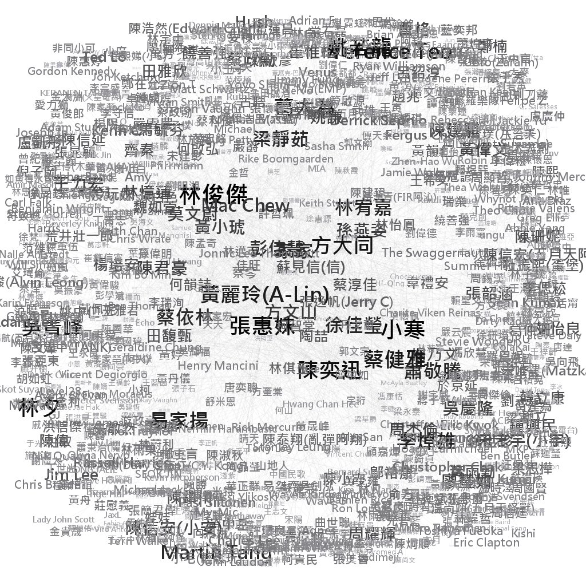

# Q4

## How many components are there in the network?

　　該網絡共有3個components，其component id分別為2、1、0。在component id
2中，僅有一個節點（郭頂）；在component id
1中，具有Algae、張懸此二節點；component id
0則包含該網絡中其餘的所有節點，為該網絡的giant component。

## Centrality Analysis in Gephi

### Network Plots

　　以下依據4種centrality指標(degree, page rank, betweenness centrality,
closeness centrality)分別繪製giant
component的網絡圖。節點文字大小與顏色深淺一同表示該centrality指標數值。

Figure 4.1: Degree

Figure 4.2: PageRank

Figure 4.3: Betweeness Centrality

Figure 4.4: Closeness Centrality

### 4.2.2 Comparison of Centrality Measures

根據以上四張網絡圖，我們發現degree與page
rank此兩種centrality指標有著相似的視覺化結果。betweenness
centrality雖與前二者有所差異，然整體變化並不強烈。closeness
centrality的結果則迥異於其它三者，以下列出各centrality指標排名前5的節點：

-   Degree: 張惠妹、陳奕迅、黃麗玲(A-Lin)、家家、蔡依林

-   PageRank: 張惠妹、陳奕迅、黃麗玲(A-Lin)、莫文蔚、林俊傑

-   Betweenness centrality:
    張惠妹、陳奕迅、黃麗玲(A-Lin)、蔡依林、林俊傑

-   Closeness centrality: 林俊傑、小寒、林夕、張惠妹、陳奕迅

　　degree與PageRank皆考量節點自身的degree值，然PageRank更進一步地考慮相鄰節點的影響力。以陳建騏為例，其degree僅有10，於Figure
4.1
degree中相當不起眼，然因與黃麗玲(A-Lin)、林宥嘉、梁靜茹等degree大者相連，故PageRank值明顯上升。

　　betweenness
centrality與前二者間變化並不劇烈，我們推測此結果與節點之degree值相關。以張惠妹與溫尚翊(五月天怪獸)為例，其degree值分別為115與3，我們認為前者作為橋樑連接不同cluster的機率應高於後者。

　　closeness
centrality的視覺化結果與前三者相差甚大，其數值不若前三者般具有明顯的高低分界，節點間的closeness
centrality數值相近、彼此間差異並不強烈，每個節點到達其他節點的最短距離相似。

## Does the giant component fit the small world model?

　　透過average path length以及clustering
coefficient，我們能夠辨識出一網絡是否符合小世界模型。該網絡的average
path length為3.977，clustering
coefficient則分別使用Gephi內建的兩種方式進行計算：

1.  Triangle Method

    -   Clustering Coefficient: 0.0147

    -   Number of triangles: 188

    -   Number of paths (Length 2): 38288

2.  Basic Method

    -   Clustering Coefficient: 0.0294

　　以下使用Gephi所產生的random
network與此網絡進行比較。在963個的節點（giant
component的節點數）、節點之間形成連結的機率為0.003（giant
component的graph density）且為無向圖的條件下，此random network的average
path length為6.413，clustering coefficient則分別為：

1.  Triangle Method

    -   Clustering Coefficient: 0.0037

    -   Number of triangles: 5

    -   Number of paths (Length 2): 4036

2.  Basic Method

    -   Clustering Coefficient: 0.0015

　　將該網絡與random network相比較，發現其average path length
(3.977)短於期望值(6.413)，兩種計算方式而得的clustering
coefficient亦高於random network之值，故我們認為該網絡符合小世界模型。
