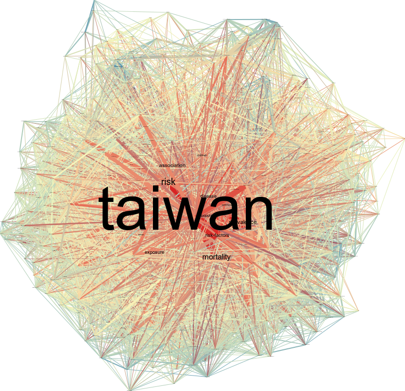
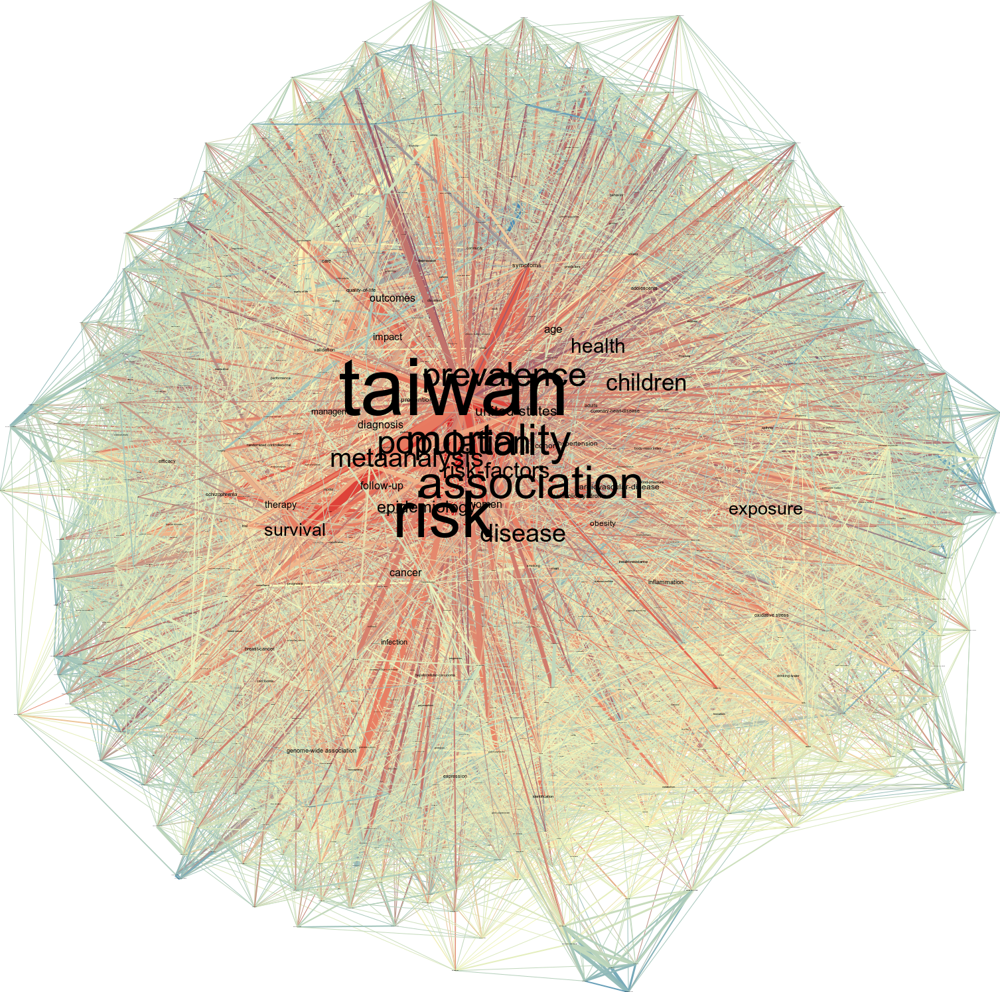

# Q2

## i.

圖 b-1 為 1972 年到 2007 年間（以下稱第一時期）台大公衛領域共同著作網絡圖，而圖 b-2 則為 2008 年到 2017 年間（以下稱第二時期）的共同著作網絡圖，其中主題標籤的大小代表該主題的 degree 數量。

整體而言，在兩個時期之中，最為熱門的主題皆是 taiwan，其他熱門主題包含 risk, association, mortality 等等。然而在第一個時期中，整體網絡的節點數為 404，每個節點平均的 degree 為 37，相比第二個時期，整體網絡的節點數為 983，每個節點平均的 degree 為 58，會發現第二個時期的網絡節點數比前一時期大超過一倍，average degree 卻只多出原來的 50 %。

從第一到第二時期，整理來說熱門的研究方向並沒有改變，但是第二時期整個公衛領域的研究範疇急速擴張，使得原先的熱門主題在這個階段看起來不再具有那麼高的中心性。

```{r echo=FALSE, out.width='50%', fig.cap='圖 b-1'}
knitr::include_graphics("2-1.png")
```

```{r echo=FALSE, out.width='50%', fig.cap='圖 b-2'}
knitr::include_graphics("2-2.png")
```


## ii

- closeness centrality

圖 b-3 為第一時期台大公衛領域共同著作網絡圖，而圖 b-2 則為第二時期的共同著作網絡圖，其中主題標籤的大小代表該主題的 closeness centrality 的大小，顏色則代表 clustering coefficient 的大小，顏色越接近紅色代表 clustering coefficient 越小，越接近藍色（或黃色）代表 clustering coefficient 的值越大。

從這兩張圖來看，會發現 closeness centrality 越大，則 clustering coefficient 越小。

```{r echo=FALSE, out.width='50%', fig.cap='圖 b-3'}
knitr::include_graphics("2-2-C.png")
```

```{r echo=FALSE, out.width='50%', fig.cap='圖 b-4'}
knitr::include_graphics("2-3-C.png")
```

- betweenness centrality

圖 b-5 為第一時期台大公衛領域共同著作網絡圖，而圖 b-6 則為第二時期的共同著作網絡圖，其中主題標籤的大小代表該主題的 betweenness centrality 的大小，顏色則代表 clustering coefficient 的大小，顏色越接近紅色代表 clustering coefficient 越小，越接近藍色（或黃色）代表 clustering coefficient 的值越大。

從這兩張圖來看，會發現 betweenness centrality 越大，則 clustering coefficient 越小。然而 betweenness centrality 和 closeness centrality 與 clustering coefficient 之間的關係的不同之處在於：

- clustering coefficient 的增加之於 closeness centrality 的減少，這樣的相對應關係是較為和緩的，即使到了網絡的較邊陲地區，closeness centrality 的圖仍能看出數個中心性較低的標籤。

- clustering coefficient 的增加，會大幅降低 betweenness centrality，故可看出在網絡的邊陲地區幾乎不存在任何可見的標籤，也呈現出 clustering 和 betweenness 之間性質上的矛盾，也就是一個節點要能夠作為橋樑，必然不容易被歸屬在任何一個 cluster 當中。

```{r echo=FALSE, out.width='50%', fig.cap='圖 b-5'}

```

```{r echo=FALSE, out.width='50%', fig.cap='圖 b-6'}

```

- eigenvector centrality

圖 b-7 為第一時期台大公衛領域共同著作網絡圖，而圖 b-8 則為第二時期的共同著作網絡圖，其中主題標籤的大小代表該主題的 eigenvector centrality 的大小，顏色則代表 clustering coefficient 的大小，顏色越接近紅色代表 clustering coefficient 越小，越接近藍色（或黃色）代表 clustering coefficient 的值越大。

從這兩張圖來看，會發現 eigenvector centrality 越大，則 clustering coefficient 越小。eigenvector centrality 和前面兩種 centrality 相比，可以看出 隨著 clustering coefficient 越大，centrality 下降的比例大於 closeness centrality 並小於 betweenness centrality。

```{r echo=FALSE, out.width='50%', fig.cap='圖 b-7'}
knitr::include_graphics("2-2-E.png")
```

```{r echo=FALSE, out.width='50%', fig.cap='圖 b-8'}

```
