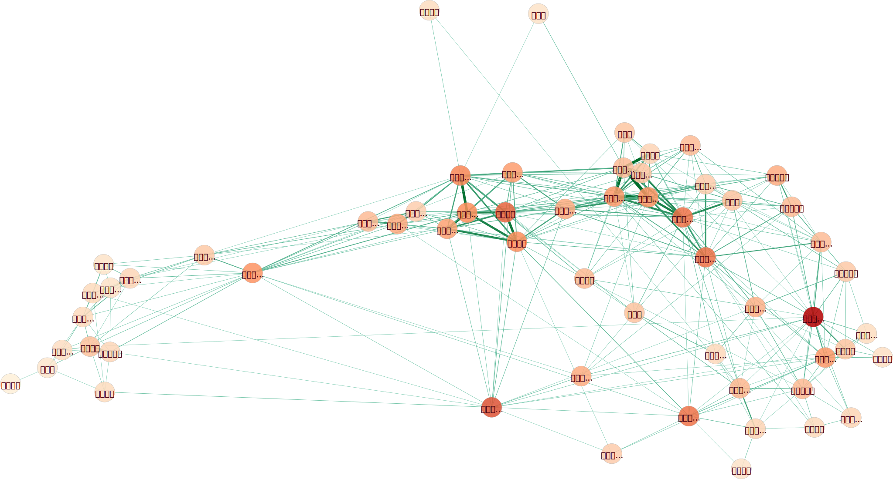
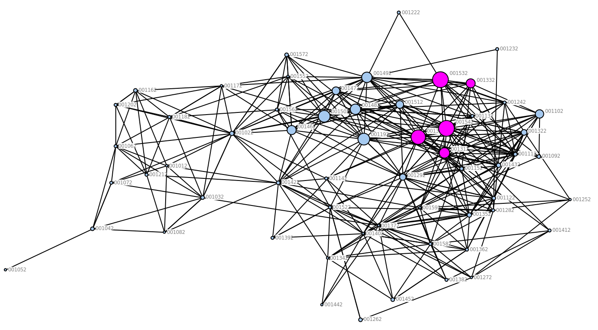

```{r setup, include=FALSE}
knitr::opts_chunk$set(echo = FALSE, fig.align = 'center')
library(knitr)
```


# Q3: 104 College Network Data


## Centrality Analysis in Gephi

<!--
- Centrality measures (Closeness, Betweenness, Eigenvector): `Network Diameter` & `Eigenvector centrality`
-->

依據 4 種 centrality 指標 (degree, eigenvector, betweeness, closeness)，所繪製出的網絡如下。網絡中的節點若顏色越深 (紅)，代表該節點的 centrality 指標越高，其 spline 的設定如圖 \@ref(fig:spline)。

```{r spline, fig.dim=c(5,5), out.width='30%',fig.cap="Centrality 指標顏色深淺變化曲線"}
eq <- function(x) 1 - sqrt(1 - x^2) 

plot(x = seq(from=0, to=1, by=0.0001), 
     y = eq(seq(from=0, to=1, by=0.0001)), type = 'l',
     xlim = c(0,1), ylim=c(0,1), xlab = "", ylab = "")
```

### Network Plots


```{r fig.cap=c('Degree', 'Eigenvector Centrality')}
include_graphics(c('q3-1-degree.svg', 'q3-1-eigen_centrality.svg'))
```


```{r betweeness, fig.cap=c('Betweeness Centrality')}
include_graphics(c('q3-1-betweeness_centrality.svg'))
```


```{r fig.cap='Closeness Centrality'}

```


### Comparison of Centrality Measures {#compare-centralities}

瀏覽這四張圖片會發現 degree centrality 與 eigenvector centrality 這兩種 centrality 指標有相似的結果，betweeness centrality 結果則與其它指標差異最大，以下列出各 centrality 指標排名前 3 的節點：

- Degree: 化學工程學系、機械工程學系、資訊工程學系
- Eigenvector: 化學工程學系、機械工程學系、資訊工程學系
- Betweeness: 外國語文學系、森林環境暨資源學系、生物產業傳播暨發展學系
- Closeness: 森林環境暨資源學系、、生物產業傳播暨發展學系、會計學系

Degree centrality 和 eigenvector centrality 兩個指標看起來皆受到一個節點的 degree 影響很大。但這兩個指標的差異在於「相鄰節點」之間的 centrality 變化程度 -- degree centrality 在節點之間的變化程度通常比較劇烈，而 eigenvector centrality 的變化通常比較緩和。原因是因為 eigenvector centrality 考量的不只是一個節點的 degree，其亦會考量一個節點的鄰居，因此除了節點本身的 degree，eigenvector centrality 也會受到鄰居節點的 degree 影響。

在這四個指標中，看起來最突出的應是 betweeness centrality。對於其它 3 個 centrality 指標，通常屬於工學院 (化工、機械、資工等) 以及管理學院 (財金、會計、國企等) 的學系，其 centrality 指標通常比較偏高，但是只有在 betweenesss centrality 上，這些節點的 centrality 指標特別低。外文系在 betweeness centrality 上是最高的，從圖 \@ref(fig:betweeness) 也可看出外文系是連通網絡中，以管理學院為主所形成的 cluster 以及以社會科學院和文學院為主所形成的另一個 cluster。類似的情形也出現在生傳系上，生傳系看起來是溝通「文學院與社科學院」、「管理學院」以及「生農學院」的橋樑。森林系則扮演了通往植微系、農藝系、園藝系與昆蟲系的重要橋樑。

透過 betweeness centrality ，也可以幫助我們了解節點的 closeness centrality -- 如果一個節點是溝通不同 cluster 的重要橋樑，它也比較有可能與「所有的其它節點」距離比較短。這個直覺在「生傳系」上很明顯：因為生傳系是網絡中 3 個 cluster (「文學院與社科學院」、「管理學院」、「生農學院」) 的橋樑，因此生傳系到網絡中的其它節點通常距離很短。但這個情況在外文系上就沒有這麼明顯，或許是因為外文系所連結的主要「管理學院」與邊陲的「文學院與社科學院」，但與位於網絡右側的 cluster 沒有明顯的連結，因此整體而言，並沒有與網絡中的其它節點距離較近。森林系乍看之下令人十分意外，但仔細看過其與其它節點的連結後，可以發現森林系與歷史系之間有一條連結，換句話說，森林系大幅降低了前往邊陲「文學院與社科學院」中的節點的距離。


## Core-periphery Analysis in UCINET

```{r ucinet, out.width='100%', fig.cap='UCINET 中的 Core-periphery analysis。在二分法中，紫色代表該節點被歸類為中心，藍色則代表邊陲的節點；至於連續性的 coreness 則以節點的大小表示，節點越大，coreness 越高。'}

```

### Gephi

透過上圖 UCINET 的 Core-periphery analysis 計算出來的數值，匯入 Gephi 後能夠與 centrality 指標進行比較。在接下來的四張圖中，每張圖的節點顏色深淺代表 centrality 指標的高低 (與 \@ref(compare-centralities) 相同)、節點與文字大小代表 coreness、紫色文字則代表該節點被歸類為中心。


```{r fig.cap=c('Degree', 'Eigenvector Centrality')}
include_graphics(c('q3-ucinet/core_v_degree.svg', 'q3-ucinet/core_v_eigen.svg'))
```

```{r fig.cap=c('Betweeness Centrality', 'Closeness Centrality')}
include_graphics(c('q3-ucinet/core_v_between.svg' ,'q3-ucinet/core_v_close.svg'))
```


在這些圖中，似乎只有 degree 以及 eigenvector centrality 最能反映網絡的中心—邊陲結構 (節點大小與節點顏色深淺呈正向關係)。這些中心節點主要為工學院和管理學院的熱門科系。這從直覺上來看也很合理：因為大家都想讀熱門科系，這些科系之間彼此形成連結是很正常的。同時，因為這些熱門科系通常招生人數比較多，也更進一步加強了其 degree 以及形成網絡的中心的可能。


## Clustering Coefficient of the Whole Network

使用 Gephi 可計算整個網絡的 clustering coefficient。這裡使用 Gephi 內建的兩種方式進行計算：

1. Triangle Method
    - Clustering Coefficient: 0.477
    - Number of triangles: 644
    - Number of paths (Length 2): 4048

1. Basic Method
    - Clustering Coefficient: 0.546

計算出來的 Clustering coefficient 需與一個參照標準比較。這裡使用 Gephi 產生的 random network 進行比較。Random network 共有 59 個節點 (即臺大申請入學網絡裡的節點數)，節點之間形成連結的機率為 0.185 (即臺大申請入學網絡的 graph density)。透過此 random network 所計算出來的 clustering coefficient 如下：

1. Triangle Method
    - Clustering Coefficient: 0.188
    - Number of triangles: 212
    - Number of paths (Length 2): 3381

1. Basic Method: 
    - Clustering Coefficient: 0.190

根據 random network 計算出來的 CC ratio ($\frac{CC~of~Actual~Network}{CC~of~Random~Network}$) 為：

1. Triangle Method: `r round(0.47727271914482117/0.18811002373695374, 3)`
1. Basic Method: `r round(0.5456022680816004/0.1899680346250534, 3)`
