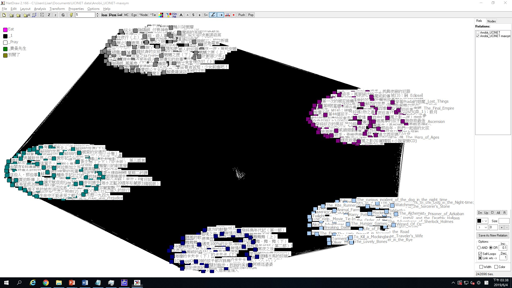
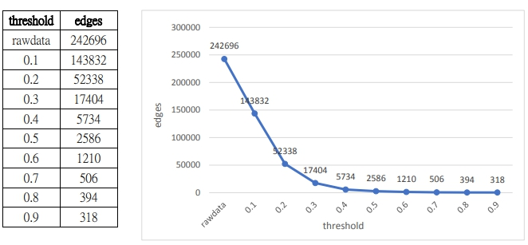
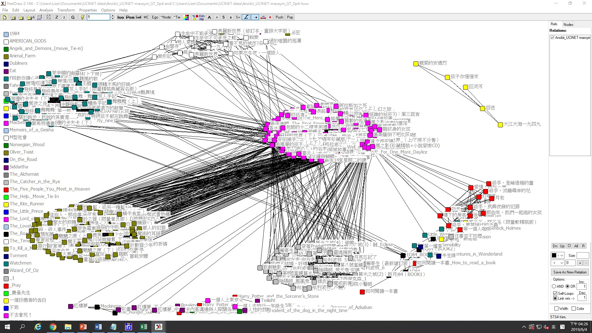
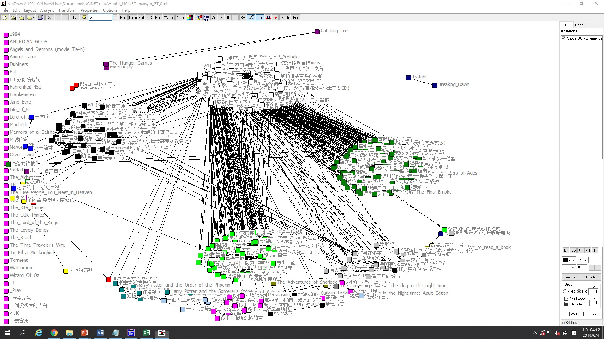

1. Community-detection with UCINET
==================================

將資料使用Maximum的方式對稱後進行以下分析：

1.1 Louvain method with raw-data
--------------------------------

-   Partition with 10 clusters: Q = 0.115

-   Partition with 17 clusters: Q = 0.109

使用Louvain
method可將資料劃分為兩種情形，分別為10與17個子群體，其Q值分別為0.115與0.109。下圖僅呈現Q值高者，即10群之情形。

1.2 Analysis with dichotomized data
-----------------------------------

### 1.2.1 Determine the proper threshold

**　　**根據上圖，可發現similarity
threshold在0.3後變化趨緩。然而，在similarity
threshold設為0.3的情況下，17404的連結數對於Louvain
method仍是有些吃重的，Girvan-Newman
method的結果上亦不盡理想，共分為103個子群體，其Q值僅有0.332。因此，將similarity
threshold訂定為0.4進行以下分析：

### 1.2.2 Louvain method (dichotomized at 0.4)

-   Partition with 96 clusters: Q = 0.621

-   Partition with 115 clusters: Q = 0.576

> 使用Louvain
> method可將資料劃分為兩種情形，分別為96與117個子群體，其Q值分別為0.621與0.576。下圖僅呈現Q值高者，即96群之情形。
>
> 對照未進行dichotomize的原始資料，可發現其Q值大幅上升，由0.115提升至0.621。

### 1.2.3 Girvan-Newman method (dichotomized at 0.4)

-   Partition with 32 clusters: Q = 0.609

