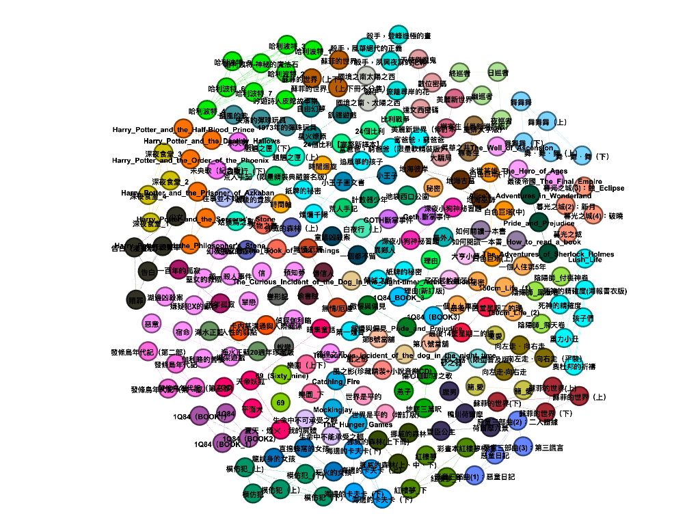
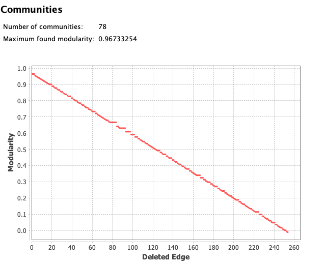
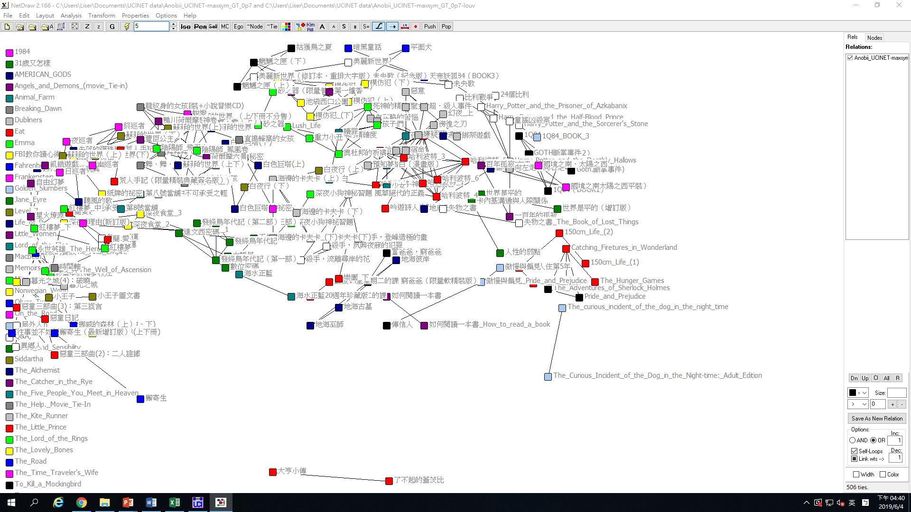
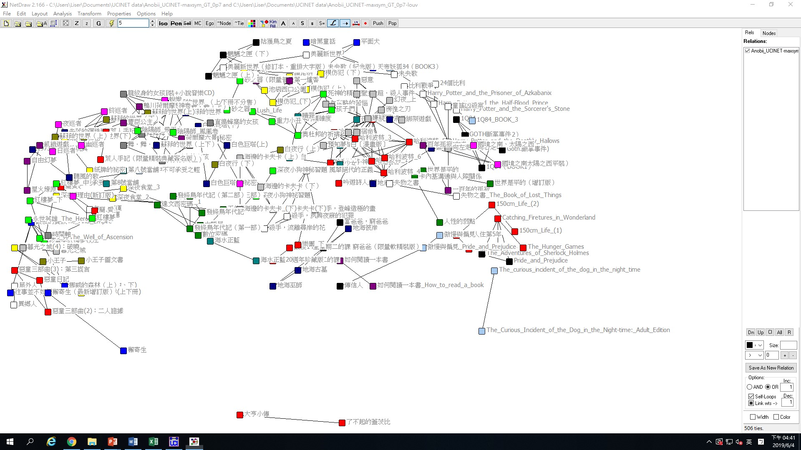
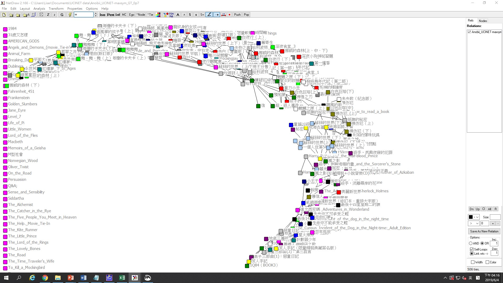
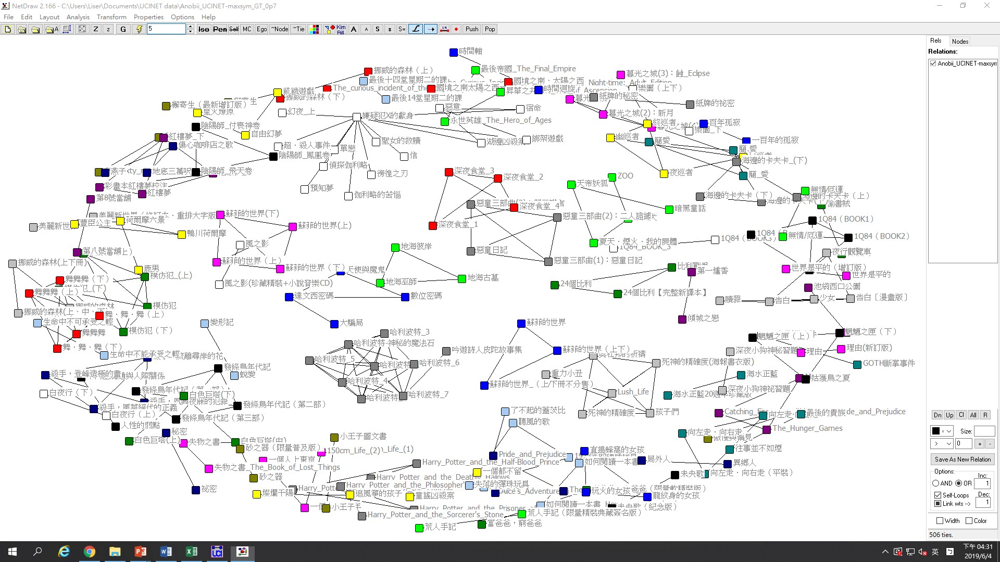

2. Community-detection with Gephi
=================================

將資料使用Maximum的方式對稱並dichotomize至0.7後，進行以下分析：

2.1 Modularity (Louvain method) with Gephi
------------------------------------------

使用Louvain method可將資料分為78群，modularity值為0.967。

2.2 Girvan-Newman method with Gephi
-----------------------------------

使用dichotomize至0.7後之資料進行分析，可將資料分為78群，modularity值為0.96733254。

2.3 Louvain method with UCINET
------------------------------

-   Partition with 341 clusters: Q = 0.949

-   Partition with 344 clusters: Q = 0.949

使用Louvain
method可將資料劃分為兩種情形，分別為341與344個子群體，其Q值皆為0.949。下圖僅呈現341群之情形。

2.4 Girvan-Newman method with UCINET
------------------------------------

-   Partition with 79 clusters: Q = 0.957

2.5 Discussion
--------------

  ------------------------------------------------------------------
  method     Louvain\   Girvan-Newman\   Louvain\   Girvan-Newman\
             (Gephi)    (Gephi)          (UCINET)   (UCINET)
  ---------- ---------- ---------------- ---------- ----------------
  clusters   78         78               341        79

  Q index    0.967      0.96733254       0.949      0.957
  ------------------------------------------------------------------

　　在Gephi中，Louvain method與Girvan-Newman
method具有相近的Q值，並且產生相同數量的分群，因此我們認為在Gephi中，此時兩種分群方法的結果是相似的。

而在UCINET中，兩者雖具有相近的Q值，然Girvan-Newman
method仍略勝一籌(0.957\>0.949)。此外，Louvain
method分出多達341個子群體，而Girvan-Newman
method僅分作79群。我們認為Louvain
method的分群結果過於細碎，Girvan-Newman
method較能夠觀察出每個子群體聚集的關係，如：地海彼岸、地海古墓、地海巫師三部由同為作者所作之作品構成一個子群體；哈利波特系列作品亦能夠觀察出此情況。因此在UCINET中，我們認為Girvan-Newman的分群結果較好。
