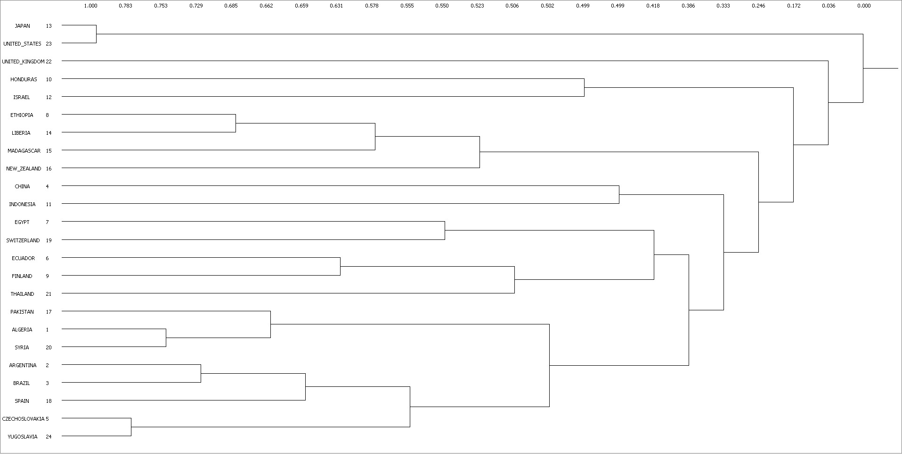
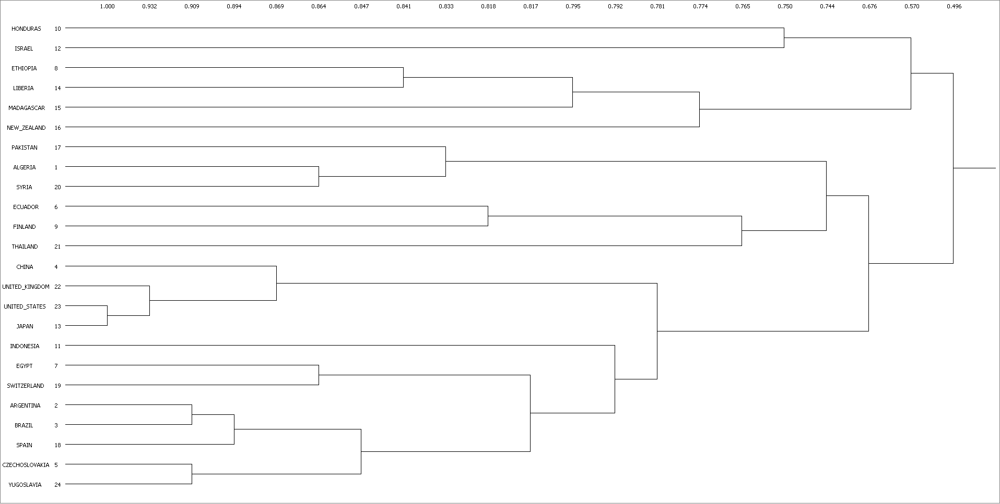
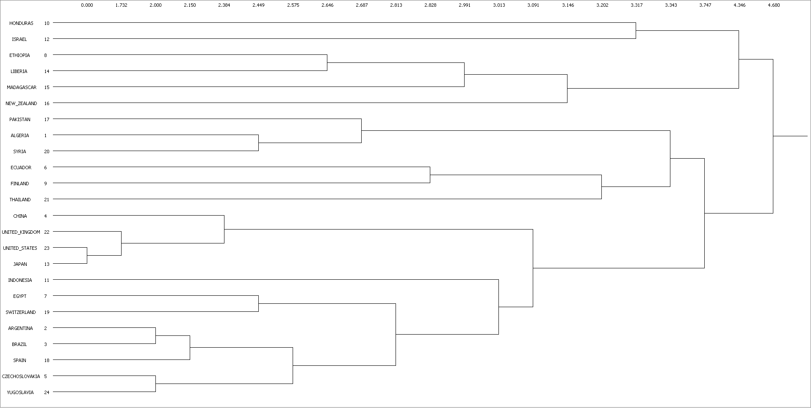

```{r}
library(knitr)
```

# 4. Structural Equivalence and Position Analysis

## (a), (b) Similarities & Dissimilarities of Trade Data

這裡使用 `Network > Roles & Positions > Structural > Profile` 以取得 similarity matrix。由於在此選項中並無 `Jaccard` 方法，因此最後使用 `correlation` 、`matches` 與 `Euclidean distance` 作為 similarity (dissimilarity) matrix 的測量單位。

另外，為了盡量讓結果「透明」，雖然 UCINET 可以同時自動處理 Trade data 中具有多個矩陣的情況，這裡仍只使用 Trade 當中的外交 (`diplomats`) 資料。

使用 `Trade-diplomats` 產生的 3 個 similarity (dissimilarity) matrix 進行 hierarchical clustering 的結果如下：

```{r fig.cap='Correlation as similarity measure'}

```

```{r fig.cap='Matches as similarity measure'}

```

```{r fig.cap='Euclidean Distance as dissimilarity measure'}

```

## (c) Comparison of Clustering & Multidimensional Scaling

使用「臺大論文口試審查委員」的資料進行 Clustering 與 MDS (皆使用 `Euclidean distance`) 之後，視覺化的結果如下：

```{r fig.cap='Hierarchical clustering (left) & Multidimensional scaling (right) on NTU thesis committee data'}
include_graphics('4-c/ntu-merged.png')
```

從 MDS 的圖可以看出圖片中央似乎有一團密集的區域 (核心)，這個現象與 clustering 的結果相當吻合 --- clustering dendrogram 的形狀是呈現三角形，亦即 dendrogram 的下方在很早期就被分成同一群，並且隨著距離的增加 (similarity 遞減)，這一群變得越來越大。換言之，Clustering 和 MDS 都顯示 NTU thesis committee data 似乎只有一個「核心」。

這個現象在與 `Trade-diplomats` 相比後會比較明顯 --- 下方的 dendrogram 很明顯的與上方呈現三角形的 NTU thesis committee data 差異很大，而這也顯示在下方的 MDS 上：`Trade-diplomats` 每點之間距離較遠，與呈現一個「核心」的 NTU thesis committee data 有相當差異。

```{r fig.cap='Hierarchical clustering (left) & Multidimensional scaling (right) on Trade-diplomats'}
include_graphics('4-c/trade-diplomats-merge.png')
```